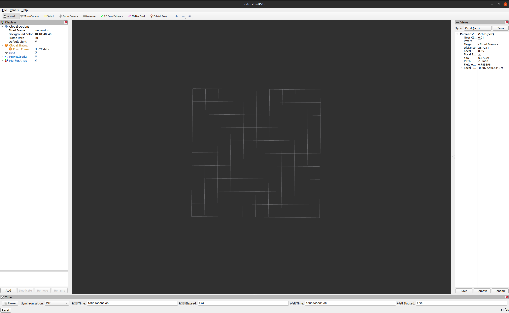

.. _Quick Start:

Quick Start
===========

This is a quick start guide to get you up and running with the
``geolocation`` package. Before continuing, make sure the package
has been installed correctly. See the :ref:`Software Installation` section
for more information.

.. _Quick Start - Verify Install:

Verify Install
--------------
Ensure all software is properly installed before attempting to run
any programs.

Innovusion LiDAR Drivers
^^^^^^^^^^^^^^^^^^^^^^^^
Before running the LiDAR package, ensure the LiDAR sensor is powered on
and it is reachable from the computer/server. You can test this by pinging
the LiDAR. 

.. code-block:: bash

    ping 172.168.1.10

Run the following commands to ensure the Inoovusion Falcon Prime
is running as expected:

* Source the ROS Install

.. code-block::

    source /opt/ros/noetic/setup.bash

* Start the LiDAR package

.. code-block::

    roslaunch innovusion_pointcloud innovusion_points.launch

The LiDAR package should start running. If the terminal continuously
prints white info messages, the LiDAR package is running as expected.

Use the keyboard shortcut ``ctrl + C`` to stop the package.

object3d_detector
^^^^^^^^^^^^^^^^^
Run the package by itself to verify it has been installed successfully.

* Run the program

.. code-block:: bash

    roslaunch object3d_detector object_detector.launch

The program should open an Rviz window that looks like this:

Geolocation Package
^^^^^^^^^^^^^^^^^^^
The package contains a launch file for demonstration purposes. Use
it to verify your installation:

.. code-block:: bash

    roslaunch geolocation demo.launch

The launch file will fake a GPS position in South Tuas, Singapore and
display the position in RViz using OpenStreetMaps. The fake GPS position
can be edited in ``/config/dummy_params.yaml``.

.. _Quick Start - Usage:

Usage
-----

To get started using ``geolocation`` in a live environment, run the
following command:

.. code-block:: bash

    roslaunch geolocation live.launch

This will launch the ``geolocation`` package with the default
configuration. The default configuration can be found in
``/config/ros_params.yaml`` and ``/config/topic_names.yaml``.

.. image:: ../images/live_launch.png
    :width: 800

The Rviz window that opens should show the data from the LiDAR,
along with any detections by the detection program. Note that
closing the window does not close the program. You are still required
to use ``Ctrl + C`` to stop the program from the terminal.

This launch command has one optional argument: ``dummy_gnss``.
Passing this argument as ``True`` will pass a static GNSS
coordinate to the program if a live GNSS coordinate cannot
be provided. 

.. code-block:: bash

    roslaunch geolocation live.launch dummy_gnss:="True"

The coordinates can be changes in ``/config/dummy_params.yaml``.
